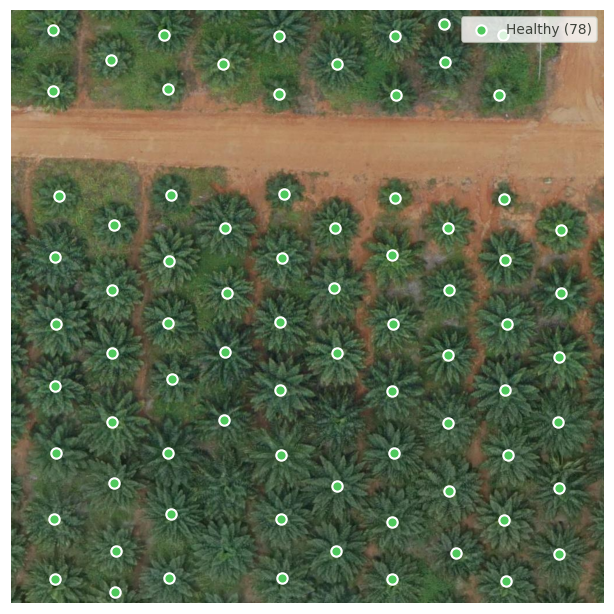
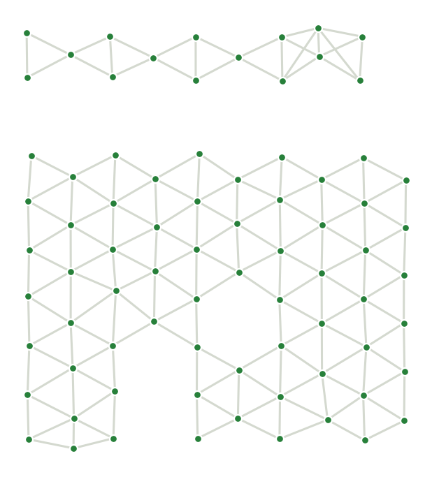
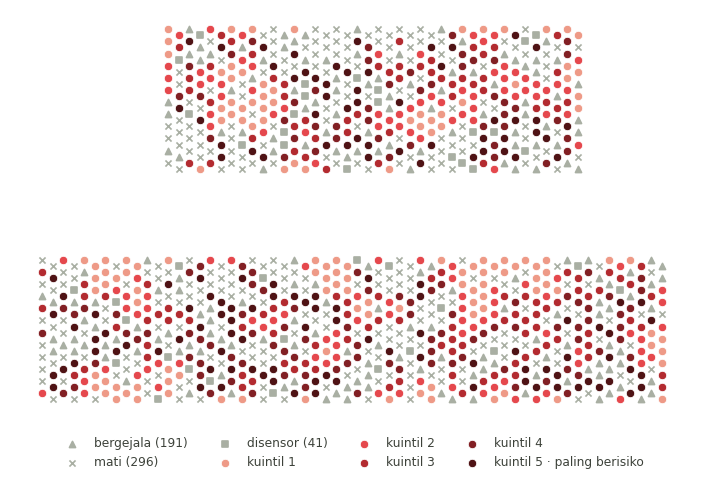
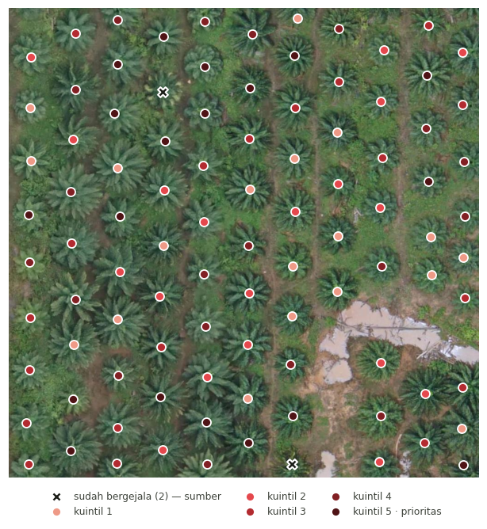

# Identifikasi Pohon Sehat Berisiko Tertinggi: Integrasi Computer Vision dan Graph Neural Network untuk Prediksi Penyebaran Penyakit Kelapa Sawit

Tim **LAPER MENN** — Rajendra Rifqi Baskara, Muhammad Brian Subekti, Muhammad Dzikri Ilmansyah
(Universitas Indonesia). Datathon 2026 RISTEK Fasilkom UI — *University Track*, babak Semifinal.

| Tautan | |
|---|---|
| Kode (GitHub) | `https://github.com/MasterTapz/LAPER-MENN` |
| Bobot model (Hugging Face) | `https://huggingface.co/Tapziy/oil-palm-detection-weights` |
| Dataset (Hugging Face) | `https://huggingface.co/datasets/Tapziy/oil-palm-detection-data` |

---

## 1. Masalah

*Ganoderma boninense* melapukkan pangkal batang sawit **dari dalam**. Pohon tampak sehat dari luar
selama berbulan-bulan hingga bertahun-tahun; saat gejala muncul di permukaan, pohon itu praktis
sudah tidak dapat diselamatkan. Karena BSR **tidak bisa disembuhkan setelah terdeteksi**, seluruh
anggaran pengendalian sebenarnya dibelanjakan untuk **pencegahan pada pohon yang belum sakit**.

Sistem computer vision yang ada berhenti pada pertanyaan *"pohon mana yang sakit sekarang"*.
Pertanyaan yang benar-benar dihadapi manajer kebun berbeda:

> Dari puluhan ribu pohon yang **masih sehat**, mana yang harus didahulukan dengan anggaran terbatas?

SawitGuard-GNN menjawab pertanyaan itu. Kebun diperlakukan sebagai **graf**: tiap pohon satu simpul,
pohon bertetangga terhubung, dan BSR merambat di atas graf tersebut lewat kontak akar. Risiko sebuah
pohon ditentukan oleh kondisi tetangganya — justru informasi yang dibuang oleh pendekatan per pohon.

## 2. Arsitektur

Dua lapisan, **sengaja tidak digabung menjadi satu model** (alasannya di §7):

**Lapisan 1 — Persepsi.** Citra UAV RGB → inventaris tajuk.
YOLOv12n mendeteksi tajuk dan memberi koordinat pusatnya; koordinat inilah (bukan sekadar jumlah
pohon) yang menjadi tulang punggung rekonstruksi geometri kebun. Luas tajuk diestimasi dengan
Excess Green + ambang Otsu. Kondisi tajuk dinilai LightGBM atas statistik warna/tekstur RGB.

**Lapisan 2 — Peramalan.** Inventaris tajuk → graf kontak → peringkat risiko.
Graf kedekatan dibangun pada radius 1,5× jarak tanam, lalu STGNN (difusi tetangga + GRU) memperkirakan
pohon asimptomatik mana yang akan bergejala dalam *h* sensus ke depan. Keluarannya **daftar pohon
berperingkat risiko**, langsung dipakai memprioritaskan tindakan.

**Jembatan antar-lapisan.** Kedua lapisan diuji pada sumber data berbeda, jadi yang diukur adalah
kecocokan bentuknya — derajat rata-rata graf pada radius tanam yang sama:
**5,54 ± 0,12** (dari prediksi detektor Lapisan 1) vs **5,74** (Eg9PP, Lapisan 2) — **selisih 3,5%**.

## 3. Menjalankan produk

Butuh **Python ≥ 3.10**. Demo berjalan **di CPU** dan **tanpa internet** (React di-vendor lokal);
GPU hanya diperlukan untuk melatih ulang Lapisan 1.

```bash
git clone https://github.com/MasterTapz/LAPER-MENN.git
cd LAPER-MENN
pip install -r requirements.txt -r requirements-dev.txt
pip install -e .
```

Bobot dan data **tidak ikut di repositori ini** — keduanya diambil dari Hugging Face:

```bash
python scripts/download_assets.py
```

Perintah di atas mengambil subset demo (~65 MB). Untuk semuanya (~520 MB: 4 lipatan YOLO, bobot
Peru, ubin UAV mentah) tambahkan `--full`. Kalau Anda sudah punya salinan lokal folder
`oil-palm-detection-model-data/`, lewati Hugging Face sepenuhnya:

```bash
python scripts/download_assets.py --from-local ../oil-palm-detection-model-data --full
```

Jalankan demo:

```bash
python scripts/run_demo.py          # http://127.0.0.1:8000
```

Unggah satu ubin citra UAV → sistem mendeteksi tajuk, membangun graf, dan mengembalikan peta serta
daftar pohon berperingkat risiko.

| | |
|---|---|
|  |  |
| Deteksi tajuk + koordinat pusat | Graf kedekatan antar pohon |
|  |  |
| Peta risiko kuantil | Peringkat risiko dari satu foto |

### Menguji

```bash
python -m pytest -q
```

Menjalankan `test_layer1_smoke`, `test_layer2_guards` (termasuk 4 penjaga kebocoran data), dan
`test_demo_api_smoke`.

### Melatih ulang

```bash
python scripts/build_datasets.py     # bangun ulang CSV beku dari data mentah (butuh --full)
python scripts/train_layer1.py       # YOLOv12n, butuh GPU CUDA 12.6 — lihat catatan di requirements.txt
python scripts/train_layer2.py       # STGNN, ~17 detik di CPU
```

## 4. Hasil

Semua angka di bawah berasal dari [`docs/RINGKASAN.csv`](docs/RINGKASAN.csv) →
[`docs/FINAL_NUMBERS.md`](docs/FINAL_NUMBERS.md). Uraian lengkapnya di
[`docs/RESULTS.md`](docs/RESULTS.md).

**Lapisan 1** — ds_B, 3 ortomosaik, validasi silang blok *leave-one-ortho-out*:

| Metrik | Nilai |
|---|---|
| F1 pusat tajuk **(utama)** | **0,960 ± 0,024** |
| Presisi / recall pusat | 0,950 ± 0,019 / 0,971 ± 0,030 |
| RMSE pusat (× jarak tanam) | 0,071 ± 0,011 |
| mAP50 (sekunder, dibatasi mutu label) | 0,687 ± 0,071 |
| Kesehatan tajuk, PR-AUC | **0,182 ± 0,059** — vs garis dasar acak 0,0130 (**14×**) |
| Kesehatan tajuk, ROC-AUC | 0,861 |

PR-AUC 0,182 terdengar rendah, tetapi garis dasarnya 1,30%: pengklasifikasi yang selalu menjawab
*Healthy* mendapat >98% akurasi tanpa berguna sama sekali. Basisnya **66 pohon sakit unik** dari
5.077 — hasil ini **underpowered** dan dilaporkan begitu, bukan disembunyikan.

**Lapisan 2** — Eg9PP, *leave-one-parcel-out*, 20 seed × 2 lipatan = 40 pasangan:

| Klaim | Nilai |
|---|---|
| Nilai **peta kontak yang benar** (asli − acak berderajat sama), varian foto | **+0,0296 ± 0,0057 — 40/40 seed** |
| Nilai punya graf apa pun (acak − tanpa graf) | +0,0087 ± 0,0047 — 39/40 |
| Bertahan saat pembanding dipaksa lokal (r ≤ 3 jarak tanam) | 85% efek dipertahankan |
| Uji permutasi dalam-famili (kekerabatan + petak dikendalikan) | **0/200 permutasi** mencapai nilai teramati (z = +6,0) |

Pemisahan itu penting: **64%** sinyal berasal dari susunan spasial, 36% dari kekerabatan genetik +
petak. Model graf di sini **membuktikan** asal keunggulannya, tidak sekadar mengklaimnya.

**Angka yang benar-benar dijalankan demo.** Demo memakai varian **1 kolom** — satu-satunya yang bisa
diberi makan satu foto:

| Jalur | AP dalam-sensus | Lift atas garis dasar 0,0632 |
|---|---|---|
| Masukan bersih | 0,0916 | **1,45×** |
| Ujung-ke-ujung (lewat detektor, recall 0,446 / FPR 0,0094) | 0,0800 | **1,27×** |

## 5. Data

| Sub-dataset | Isi | Lisensi |
|---|---|---|
| `layer1_uav_crowns` | Ubin UAV RGB nadir, **5.077 tajuk unik**, label Healthy/Unhealthy | CC BY 4.0 (Roboflow) |
| `layer2_eg9pp_panel` | **1.200 sawit, 45 sensus, 25 tahun**, 14 famili, 2 parcel; gejala Ganoderma terverifikasi lapangan | **CC BY-SA 4.0** (Tisné dkk. 2017, PalmElit/CIRAD) |
| `peru_palm_anomaly` | Citra sawit Peru, jalur bukti lintas-lokasi terpisah | CC BY 4.0 |

`layer2_eg9pp_panel` berlisensi **share-alike** — turunannya wajib memakai lisensi yang sama.
Lisensi MIT pada `LICENSE` hanya menutupi **kode**.

> ⚠️ **Peringatan mutu data yang kami temukan sendiri.** `layer1_uav_crowns` bukan tiga dataset
> independen: 151.060 kotak anotasi hanya **5.077 pohon unik** (**replikasi semu 29,8×**; satu pohon
> muncul di median 32 ubin), dan pembagian bawaan Roboflow bocor **100%**. Karena itu seluruh
> evaluasi memakai blok *leave-one-ortho-out*, bukan pembagian acak. Buktinya ada di
> `AUDIT_REPORT.md` pada repositori model-data.

## 6. Struktur repositori

```
src/oil_palm/
  config.py          resolusi path terpusat (env: SAWITGUARD_DATA_ROOT)
  layer1/            deteksi tajuk (y12), kesehatan (exp_health), segmentasi, jalur Peru (anom)
  layer2/            dataset/model/pelatihan STGNN, ekspor risiko, INTERFACE.md
  demo/              core.py (semua komputasi) · api.py (Starlette) · app_streamlit.py (cadangan)
scripts/             download_assets · build_datasets · train_layer1 · train_layer2 · run_demo
web/                 frontend React (vendor lokal, tanpa npm)
data_clean/          pembangun dataset + kartu dataset (CSV beku diambil terpisah)
docs/                RESULTS.md · FINAL_NUMBERS.md · RINGKASAN.csv · figures/
tests/               smoke test + penjaga kebocoran
```

`demo/core.py` memuat **seluruh** komputasi demo dan bisa dijalankan sendiri
(`python -m oil_palm.demo.core`) untuk mencetak setiap angka yang muncul di layar — sehingga UI web
dan UI Streamlit tidak mungkin berbeda hasil.

## 7. Batasan yang diketahui

Kami mencantumkannya karena penilaian menuntut konsistensi antara klaim dan bukti.

1. **Kedua lapisan tidak digabung.** Tidak ada himpunan data yang memuat citra UAV *sekaligus*
   riwayat penyebaran per pohon. Yang diukur adalah kecocokan bentuk graf (§2), bukan pipeline
   ujung-ke-ujung pada satu kebun.
2. **Label Lapisan 1 generik**, bukan BSR terverifikasi lapangan: keluarannya menunjukkan pohon
   berkondisi buruk tanpa membedakan penyebabnya.
3. **Hasil kesehatan underpowered** — 66 positif unik, tiga ortomosaik, satu himpunan data. Tidak
   ada klaim generalisasi lintas lokasi.
4. **Model memeringkat dengan baik tetapi tidak terkalibrasi.** Akibat focal loss, skor 0,50–0,60
   sebenarnya hanya ~23,6% sakit. Pakai sebagai **peringkat**, jangan dibaca sebagai probabilitas.
5. **Kepala mekanistik SI(D) gagal** — negatif di keempat horizon. Kami melaporkannya, tidak
   membuangnya.
6. **Agregasi ke skala blok merugikan** (lift 1,24× < per pohon 1,61×): sinyalnya berskala pohon.
7. **Jalur Peru hanya 1 lipatan / 1 seed** (mAP50 0,9495) — bukti pendukung, tidak boleh disandingkan
   langsung dengan 0,960 ± 0,024 milik ds_B.

## 8. Atribusi

- Tisné, S., dkk. (2017). *Identification of Ganoderma disease resistance loci using natural field
  infection of an oil palm multiparental population.* G3, doi:10.1534/g3.117.041764. — panel Eg9PP.
- *Oil Palm Health Detection*, Roboflow Universe — ubin UAV Lapisan 1.
- Peru palm anomaly dataset, doi:10.17632/nh7d23dgnw.1.
- Tian, Y., Ye, Q., & Doermann, D. (2025). *YOLOv12: Attention-centric real-time object detectors.*

Kode di bawah lisensi MIT (lihat `LICENSE`); data dan bobot mengikuti lisensi hulunya masing-masing.
